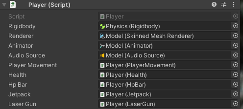
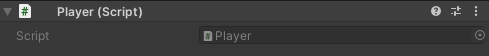
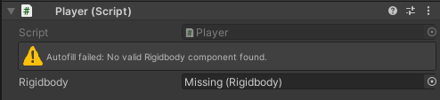

# Autofill
Autofill is a simple Unity extension that can automatically assign serialized component references for you at edit time. If a reference is successfully autofilled, it will be hidden in the Inspector, allowing you to safely ignore it like the implementation detail it is. This provides all the ease of use of calling `GetComponent` with none of the runtime costs!

Autofill turns messy Inspectors like this:

into this:

## Installation
We recommend you install Autofill via [OpenUPM](https://openupm.com/packages/com.jonagill.autofill/). Per OpenUPM's documentation:

1. Open `Edit/Project Settings/Package Manager`
2. Add a new Scoped Registry (or edit the existing OpenUPM entry) to read:
    * Name: `package.openupm.com`
    * URL: `https://package.openupm.com`
    * Scope(s): `com.jonagill.autofill`
3. Click Save (or Apply)
4. Open Window/Package Manager
5. Click the + button
6. Select Add package by name...
6. Click Add

## Using Autofill
To enable Autofill for a serialized field on a given component, you must mark it up with the `[Autofill]` or `[AutofillOptional]` attributes.

### [Autofill]
A serialized component field marked with `[Autofill]` will be automatically filled whenever the component is viewed in the Inspector or a prefab containing the component gets saved. If the component is found, we hide the field in the Inspector to avoid cluttering the component with useless property drawers.

If the component is not found, we display an error into the Inspector like so: 

### [AutofillOptional]
A serialized component field marked with `[AutofillOptional]` will be automatically filled whenever the component is viewed in the Inspector or a prefab containing the component gets saved. If the component is found, we hide the field in the Inspector to avoid cluttering the component with useless property drawers.

Unlike `[Autofill]`, we do not display an error if no component could be found, as this component is understood to be optional. Any references to that component should be wrapped in nullity checks within your component logic.

### Additional parameters
Both `[Autofill]` and `[AutofillOptional]` take a number of constructor parameters:

#### type
The `type` parameter specifies where the Autofill system will search to try and find a valid target component to assign to the autofilled reference. There five possible options:

* Self *(default)*
    * Autofill will only check the GameObject containing the declaring component for the target component.
    * This is equivalent to a `GetComponent` call.
* Parent
    * Autofill will check all the parents of the GameObject containing the declaring component for the target component.
* SelfAndParent
    * Autofill will check both the GameObject containing the declaring component and all of its parents for the target component.
    * This is equivalent to a `GetComponentInParent` call (since that call also checks the invoking object for the desired component).
* Children
    * Autofill will check all descendants of the GameObject containing the declaring component for the target component.
* SelfAndChildren
    * Autofill will check both the GameObject containing the declaring component and all of its descendants for the target component.
    * This is equivalent to a `GetComponentInChildren` call (since that call also checks the invoking object for the desired component).

#### acceptFirstValidResult
The Autofill system usually displays an error if it finds multiple valid target components when trying to fill a reference. If this parameter is set to true, the Autofill system will accept the first result it finds (usually the closest component to the declaring component in the hierarchy).

#### alwaysShowInInspector
The Autofill will usually hide autofilled references that have been successfully filled in the Inspector. If this parameter is set to true, the Autofill system will draw a disabled version of this field instead of hiding it entirely.

## Limitations
* Autofill is not currently supported on serialized arrays or lists.
